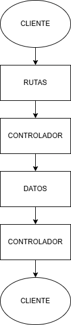
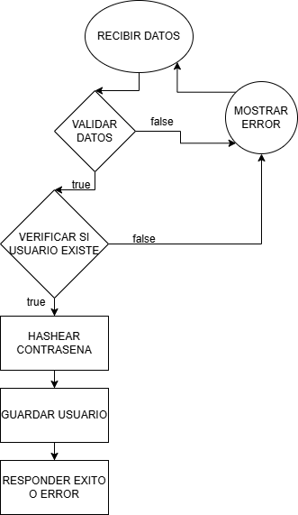
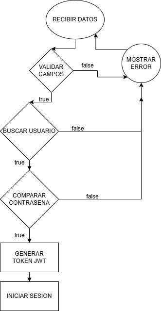

 # Documentación de Diseño

## Arquitectura del proyecto

La API sigue una arquitectura en capas, donde cada capa tiene una responsabilidad específica:

| Capa | Archivo | Responsabilidad |
|---|---|---|
| Entrada | `index.js` | Inicia el servidor |
| Configuración | `src/app.js` | Configura Express y registra rutas |
| Rutas | `src/routes/authRoutes.js` | Define los endpoints disponibles |
| Controlador | `src/controllers/authController.js` | Contiene la lógica de negocio |
| Middleware | `src/middlewares/verifyToken.js` | Verifica tokens JWT |
| Datos | `src/data/users.json` | Almacena los usuarios registrados |

## Flujo de una petición

Una petición recorre las capas en este orden:
Cliente → Rutas → Controlador → Datos → Controlador → Cliente

## Decisiones de diseño

**¿Por qué archivo JSON como base de datos?**  
Para que el proyecto sea autónomo y pueda ejecutarse sin instalar ni configurar un motor de base de datos externo.

**¿Por qué JWT?**  
Permite autenticar usuarios sin guardar sesiones en el servidor. El token contiene la información necesaria y tiene fecha de expiración.

**¿Por qué bcryptjs?**  
Permite hashear contraseñas de forma segura antes de almacenarlas, de modo que nunca se guarda la contraseña en texto plano.

## Diagramas

